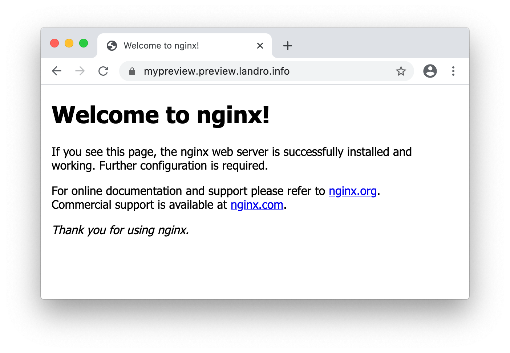

# Instructions

## Required software

- kubectl 
- helm v3
- jsonnet
- doctl

## Select preview domain and point 

    Edit terraform.tfvars.json to fit your needs
    
    Register NS records for preview domain with current provider
    // ns1.digitalocean.com.
    // ns2.digitalocean.com.
    // ns3.digitalocean.com.

## Export Digital ocean token in shell, and create infra

    export DIGITALOCEAN_TOKEN="xxx"

    terraform apply
   
## Retrieve kubeconfig by running command output in terraform apply   

## Install nginx ingress controller

    helm install nginx ingress-nginx --repo https://kubernetes.github.io/ingress-nginx
    
## Install external-dns

    jsonnet external-dns.jsonnet --ext-str DIGITALOCEAN_TOKEN=$DIGITALOCEAN_TOKEN | kubectl apply -f -
        
## Deploy cert manager with ACME DNS01

    kubectl create namespace cert-manager
    kubectl apply --validate=false -f https://github.com/jetstack/cert-manager/releases/download/v1.0.3/cert-manager.crds.yaml
    helm install cert-manager cert-manager --namespace cert-manager --version v1.0.3 --repo https://charts.jetstack.io

    jsonnet letsencrypt.jsonnet --ext-str DIGITALOCEAN_TOKEN=$DIGITALOCEAN_TOKEN | kubectl apply -f -

## Deploy an example app (dummy nginx container incl ingress, service and deployment)

    jsonnet deployment.jsonnet | kubectl apply -f -
    
## Result

